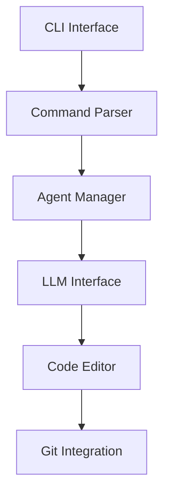

# Codex Analysis: Aider

## 📌 Purpose
Aider is an AI pair programming tool that integrates with your terminal, allowing seamless collaboration with large language models (LLMs) to edit codebases efficiently.

## 🧭 High-Level Architecture

## 🗂️ Module Overview

| Module/Dir        | Purpose                                      |
|-------------------|----------------------------------------------|
| `aider/cli.py`    | Handles command-line interactions            |
| `aider/commands/` | Parses and executes user commands            |
| `aider/agents/`   | Manages different AI agents                  |
| `aider/edit/`     | Applies edits to the codebase                |
| `aider/git/`      | Integrates with Git for version control      |

## 🔍 Noteworthy Patterns

- Utilizes a modular design separating concerns like command parsing, agent management, and editing.
- Employs Git integration to track changes and manage versions seamlessly.
